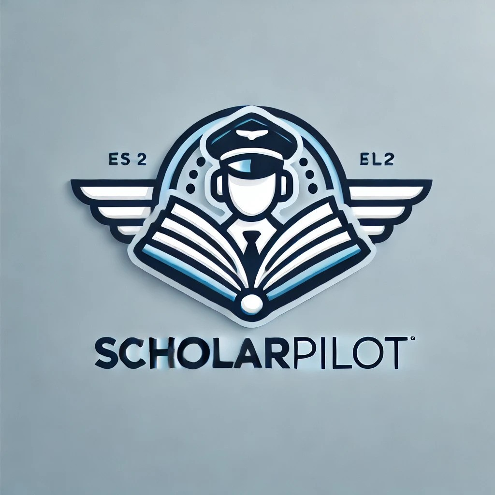
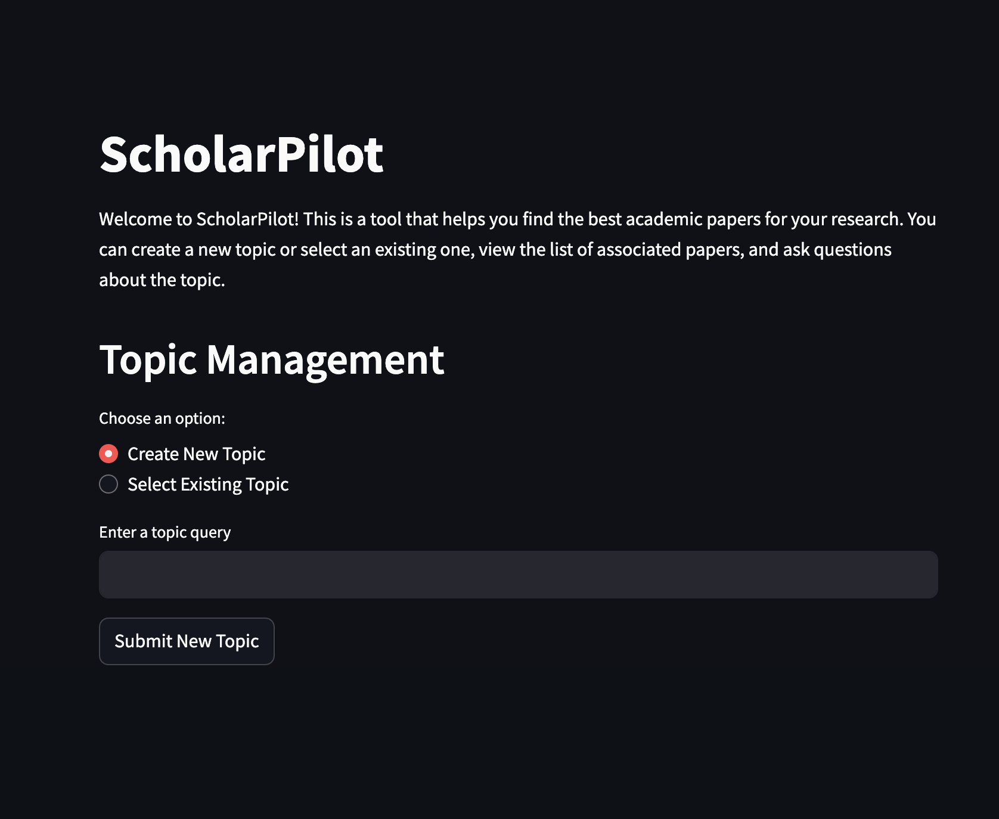
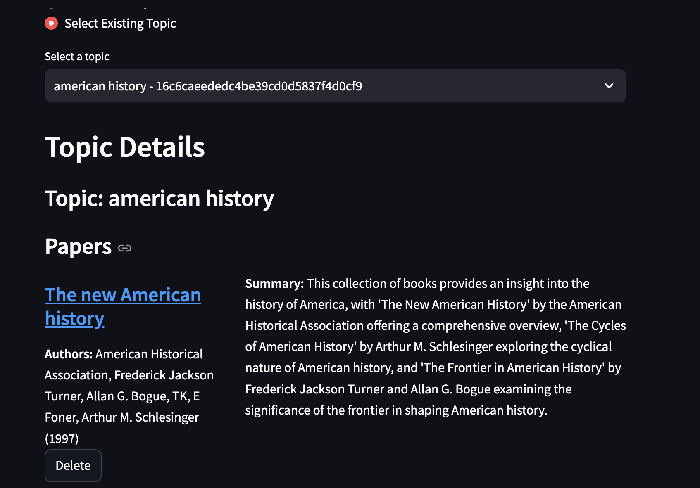
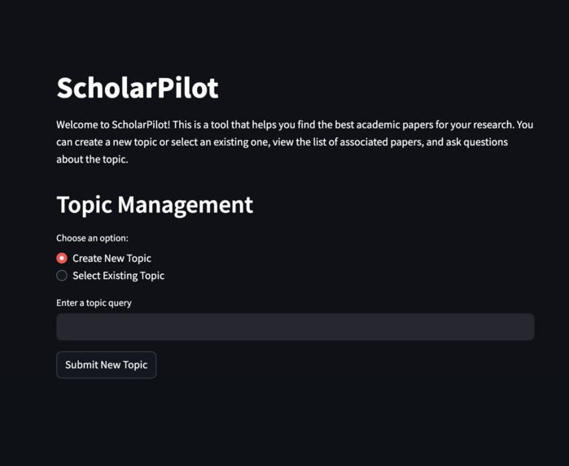

# ScholarPilot

## Demo
- [Video Demo](https://youtu.be/GM2xk5Vc6_E)
- 
- 
- 
- 

## Inspiration

ScholarPilot was born from the desire to streamline academic research. I recognized that researchers often struggle to find relevant, high-quality resources amidst a sea of information. Inspired by the concept of a dedicated research assistant, I set out to create a tool that not only curates and cleans data from academic sources but also engages users in meaningful discussions about the literature. My focus was to simplify resource discovery while helping users maintain concentration on their core research topics.

---

## What It Does

ScholarPilot leverages a multi-AI agent system to assist researchers through several steps:

- **Topic Input & Data Collection:**  
  The first agent accepts a user-provided topic and scrapes Google Scholar for relevant papers. It then cleans the retrieved data using an LLM (Large Language Model) to ensure quality and coherence.

- **Deep Dive & Summarization:**  
  The second agent takes the refined data and navigates through each linked resource to gather more detailed information. It then generates concise summaries to help users quickly grasp the essence of each paper.

- **Interactive Chatbot:**  
  The final agent acts as a chatbot, engaging with users in discussions about the topic and the curated papers. It also allows users to remove papers they aren’t interested in, with future plans to expand the system to include additional papers and explore related topics dynamically.

---

## How I Built It

My development journey for ScholarPilot involved several key steps:

1. **Backend Development:**  
   I started by building a robust backend using FastAPI. This served as the foundation for the multi-agent system and ensured smooth communication between the various components.

2. **Multi-Agent Integration:**  
   Using LangChain, I orchestrated my first multi-AI agent system. Each agent was designed to handle a specific part of the workflow—from data scraping and cleaning to summarization and user interaction.

3. **State Management & Database Integration:**  
   As the project evolved, I integrated Firebase to manage state and store user data, ensuring that the system could handle updates and modifications seamlessly.

4. **Frontend Implementation:**  
   Finally, I developed an interactive frontend using Streamlit, connecting it with the backend API to create a cohesive user experience.

*This project also marked my first time working with FastAPI, Streamlit, and LangChain together, making it a significant milestone in my development experience.*

---

## Challenges I Ran Into

Developing ScholarPilot was not without its challenges:

- **New Concepts Under Tight Deadlines:**  
  I encountered several novel concepts and had to implement complex integrations quickly. Learning on the fly was essential, and working under time constraints added an extra layer of difficulty.

- **Cloud Services Integration:**  
  Incorporating cloud services, particularly through Modal, presented a steep learning curve. Ensuring reliable and scalable deployment of the AI agents required navigating unfamiliar cloud infrastructure and service orchestration challenges.

---

## Accomplishments That I'm Proud Of

I'm particularly proud of:

- **Building My First Multi-AI Agent System:**  
  Successfully integrating multiple AI agents to work in concert was a significant technical achievement.

- **Embracing New Technologies:**  
  This project was my first foray into using FastAPI, Streamlit, and LangChain, which has broadened my technical skill set and opened up new possibilities for future projects.

- **Rapid Prototyping & Iterative Development:**  
  Despite the challenges, I managed to build a fully functional research assistant that not only collects and summarizes academic resources but also interacts with users in a meaningful way.

---

## What I Learned

Through this project, I gained invaluable insights, including:

- **Mastering New Tools and Platforms:**  
  I became proficient with FastAPI, Streamlit, LangChain, and Modal, learning how to integrate them into a seamless application.

- **Effective API Design & State Management:**  
  Developing a clean API that bridges the backend and frontend was crucial. I also learned the importance of maintaining consistent state across multiple AI agents.

- **The Power of Iterative Development:**  
  Building and refining each agent step by step allowed me to manage complexity and improve functionality over time.

---

## What's Next for ScholarPilot

Looking ahead, I plan to enhance ScholarPilot by:

- **Expanding Content Coverage:**  
  Adding more papers and exploring topics derived from the initially selected papers to provide users with a broader scope of research materials.

- **Improving User Interactions:**  
  Enhancing the chatbot capabilities to offer deeper, more insightful discussions and more robust feedback mechanisms.

- **Refining the AI Agents:**  
  Continuously improving the performance and accuracy of the AI agents based on user feedback and evolving research needs.

With these enhancements, I aim to make ScholarPilot an even more powerful tool for researchers, streamlining the journey from discovery to understanding in the academic realm.
